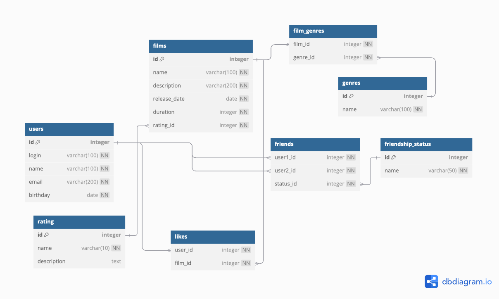

# java-filmorate

Template repository for Filmorate project.

# Filmorate Database Schema

## ER-Диаграмма

Моя версия ER-диаграммы БД Filmorate:



---

## Описание таблиц

БД состоит из 8 таблиц:
-users(PK id, FK с таблицей friends тоже id (связь один ко многим));
-friends(FK user1_id, user2_id с таблицей users(связь один ко многим));
-friendship_status(PK id, FK с таблицей friends тоже id (связь один ко многим));
-films(PK id, связь многие-к-многим с таблицей genres с помощью таблицы-посредника film_genres);
-film_genres (таблица-посредниц для связи films и genres);
-genres(PK id);
-likes(два FK:user_id к users, film_id к films)
-rating(PK id, одновременно FK для films).

## Примеры SQL-запросов

### 1. Найти пользователя с наибольшим количеством лайков:

```sql
SELECT user_id, COUNT(film_id) AS like_count
FROM likes
GROUP BY user_id
ORDER BY like_count DESC
LIMIT 1;
```

### 2. Найти общих друзей:

```sql
SELECT u.name AS friend_name
FROM users u
WHERE u.id IN (
    SELECT f1.user2_id
    FROM friends f1
    JOIN friends f2 ON f1.user2_id = f2.user2_id
    WHERE f1.user1_id = 1 AND f2.user1_id = 2
);
```
